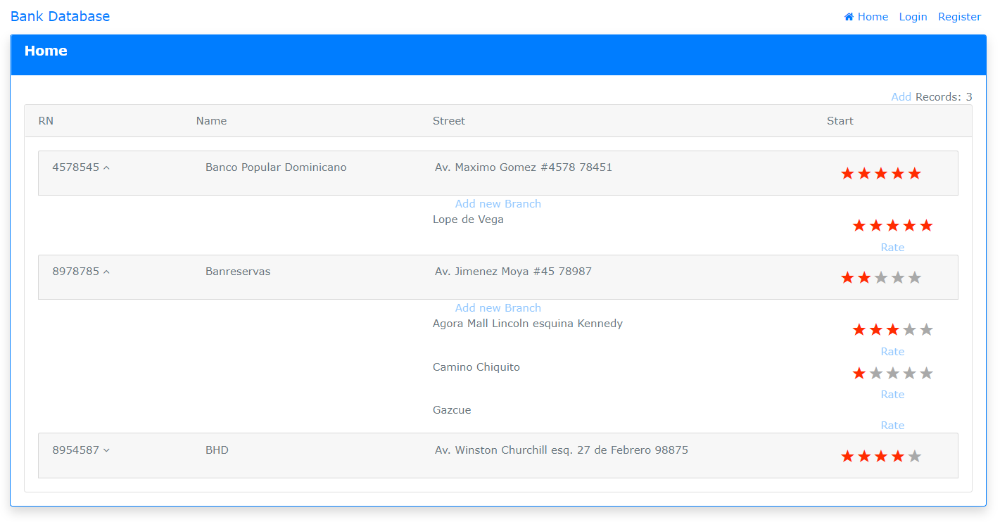

# BankDB
BankDB (Application to rate Banks and their branches.

<h2>Backend side:</h2>

<b>Project type:</b> Web Api.

Framework: [.Net 4.6.1] Microsoft asp web api 2, Entity Framework 6.0, The security was implemented using Microsoft Owin libraries.

Database: Microsoft SQL 2014, Local DB loaded in the project inside App_Data folder.

<h2>Frontend side</h2>

<b>Client framework used:</b> AngularJS 1.7, other JS libraries used: JQuery and Bootstrap for patter design. The logic of the client 
application is located in the folder web and the started page is <b>index.html</b>. The logic for the aplication is located at: scripts/app/app.js file 
and you can see the rest of the js scripts inside the app root folder.

The web application was developed using single page application technology.

<h2>Application Purpose</h2>

The purpose of the application is give the user the ability to view banks rating and general information
at the same time the user can rate the banks based on a five-star scale. Each bank can have multiple
branches and the ratings will be branch-base, the overall rating of the bank will be calculated based on
the branches ratings. The user should be able to see the last time the bank/branch information was
updated.

The solution must have two main components:

• Restful API

• Web application (SPA preferably)

In this model, the banks can use the API to query the ratings also update the bank information, add
and/or remove branches, each bank must provide a valid API key/token to access/query its ratings and
update the information. Each bank must be registered as a client and the key/token associated to it.
Banks should be able to see ratings either per branch or globally, also the bank must have the ability to
see the historical ratings at a given date.
The users must be registered to rate a bank and only one rating per user per branch is allowed, to be
able to rate a branch, the user must be logged in.
